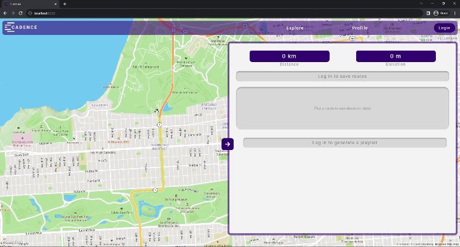
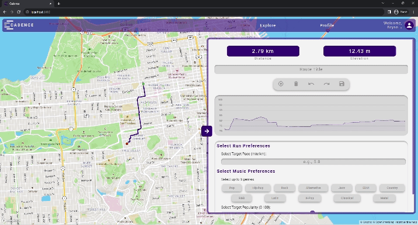
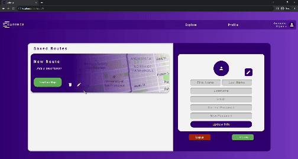
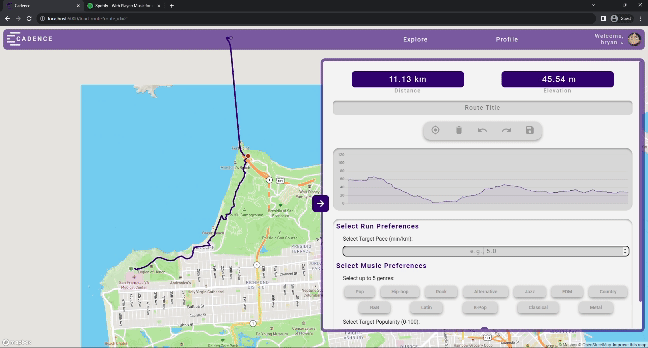
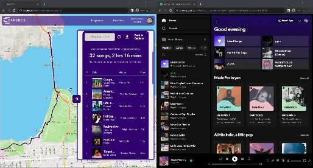

# <a name="summary"> 

Cadence is an app that builds a tailored music playlist based on the users’ music preferences and running session. Users plot their desired running route using the Mapbox API and select their run goals (e.g., target pace, target time, target intensity) for their session. The Graphhopper API is then used to retrieve elevation data along the specified running route. The Spotify API is leveraged to dynamically generate a playlist based on the user's goals and preferences.

</br>

**Table Of Contents**

- [Summary](#summary)
- [Tech Stack](#tech-stack)
- [Features](#features)
- [Installation](#installation)
- [About Me](#about-me)

## <a name="tech-stack"></a>Tech Stack

**Frontend:** HTML5, CSS, Javascript <br/>
**Backend:** Python, Flask, PostgreSQL, SQLAlchemy <br/>
**APIs:** Mapbox, Graphhopper, Spotify, Cloudinary <br/>

## <a name="features"></a> Features

Users can plot a route with waypoints. Routing supports undo/redo/clear functionality:



Users can also save a plotted route to their account:



Saved routes can be edited, deleted, and loaded to the map:



Users can select running goals and music preferences, which will then be used to generate a playlist:



Generated playlists can be exported to the user's linked Spotify account:



## <a name="installation"></a> Installation

#### Requirements:

- PostgreSQL
- Python 3.7.3
- Mapbox, Graphhopper, and Spotify API keys

Follow the following steps to run on your local computer:

Clone repository:

```
$ git clone https://github.com/franciscobortega/Cadence.git
```

Create and activate a virtual environment:

```
$ pip3 install virtualenv
$ virtualenv env
$ source env/bin/activate
```

Install dependencies:

```
(env) $ pip3 install -r requirements.txt
```

Sign up to use the [Mapbox API](https://docs.mapbox.com/api/overview/), the [Graphhopper API](https://www.graphhopper.com/developers/), the [Spotify API](https://developer.spotify.com/documentation/web-api), and the [Cloudinary API](https://cloudinary.com/developers).

Save your API keys in a file called <kbd>config.py</kbd> using this format:

```
class Config:
  MAPBOX_ACCESS_TOKEN="YOUR_KEY_HERE"
  SPOTIFY_CLIENT_ID="YOUR_ID_HERE"
  SPOTIFY_CLIENT_SECRET="YOUR_SECRET_HERE"
  CLOUDINARY_KEY="YOUR_KEY_HERE"
  CLOUDINARY_SECRET="YOUR_SECRET_HERE"
```

Also save the following API keys in a file called <kbd>secrets.js</kbd> using this format:

```
class Config:
  export const MAPBOX_API_KEY="YOUR_KEY_HERE"
  export const GRAPHHOPPER_API_KEY="YOUR_KEY_HERE"
  export const SPOTIFY_CLIENT_ID="YOUR_ID_HERE"
```

Run the database seeding script:

```
(env) $ python3 seed.py
```

Start the backend server:

```
(env) $ python3 server.py
```

Navigate to `localhost:5000` in your browser to see the web app

## <a name="about-me"></a> About me

This was my capstone project for the Hackbright Fellowship. Connect with me on [LinkedIn](http://www.linkedin.com/in/bryanortega/)!
